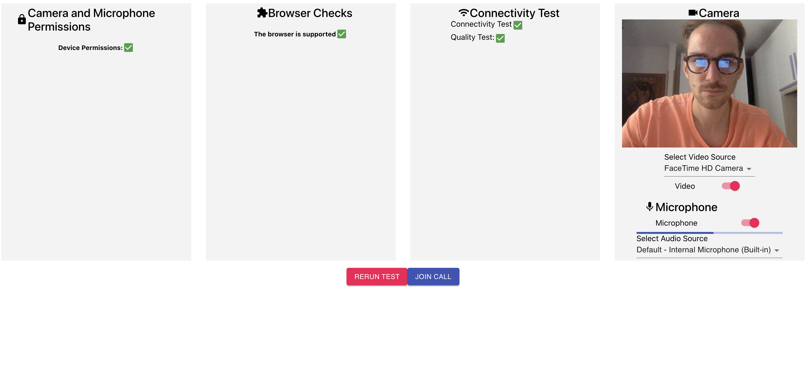

# Network Test Sample App

This project is a React Sample App that shows how to integrate the Vonage Video Network Test [https://www.npmjs.com/package/opentok-network-test-js](https://www.npmjs.com/package/opentok-network-test-js).

## Project Structure

The project has two main views:

1. Home: sample component with a Home view to demonstrate React Router 
2. Waiting Room: page with the network test and browser checks included

### Waiting Room

The Waiting Room view is composed by four Cards:

1. **Browser checks**: this card uses the [checkRequirements](https://tokbox.com/developer/sdks/js/reference/OT.html#checkSystemRequirements) function to check if the browser supports WebRTC
2. **Device Access**: this card uses the `accessAllowed` and `accessDenied` events to check if the user has accepeted or denied the microphone and camera permissions
3. **Connectivity Test**: this card implements the `testConnectivity` and `testQuality` of the  `opentok-network-js` module. The `testConnectivity` checks the connectivity to Vonage Video Servers. The `testQuality` return back the expected quality for microphone and camera streams.
4. **Microphone and Camera selection**: This card uses the `OT.getDevices` to fill the microphone and camera select menu. It also implements the audio and video toggle function to mute and unmute the streams. 

## Run the Project

1. Run `npm install`
2. Copy `.env.example` to `.env` and fill the variables
4. Run locally with `npm start` 

## Screenshot

